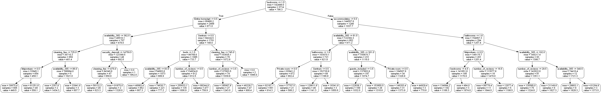
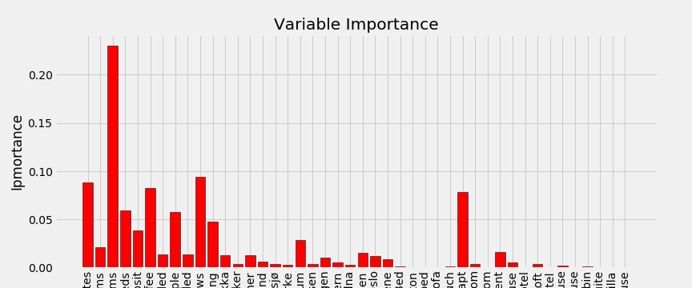

# Data-driven approach to pricing

    

# Introduction

***

## About Airbnb

Instead of copying other travel sites like Travelcity and Expedia, Airbnb takes a unique approach toward lodging. As one of the recent mastodonts in the *scaring economy*, Airbnb offers someone's home as a place to stay instead of a hotel. 

> *Founded in 2008 airbnb exists to create a world where anyone can belong anywhere* - airbnb

Airbnb Uniquely levarages technology to economically empower millions of people around the world to unlick and monetize their spaces. They accomodation marketplace provides access to 6+ million unique unique places to stay in more than 81.000 cities and 191 countires (Airbnb, 2018, https://press.airbnb.com/about-us/) 

## Problem statement 

As a part of SMM641 (Revenue Management and Pricing) we aim to help airbnb hosts (both current and new hosts) to price their listings such that they maximize revenue. Utelize open-source data from Airbnb, create a price recommender engine based on a demand function from segments/classes of hosts that share simillar attributes.

### Overall Business Goals

1. Explore and utilize the data available at airbnb in a pricing environment 

2. Explore the pricing at airbnb and uncover what are the significant factors of a given listing.

3. Model demand, based on given data 

4. Build a decision model based on the above criterias   
 
In this project, we aim to deliver a funtional model that allows airbnb host to optimally price their listings. While we strive for accuracy, our core and underlying objective remains to produce a baseline optimal price recommender engine that may be easily improved in the future should one intend to add more variable/data or new features. We will base our model with logical reasoning backed with economics theorum *(Price elasticity, Price and demand relationship)*.

Future considerations: The next step we hope to achieve within this model is work towards eliminating some of the assumption we have been forced to adopt as well as building a flexibility and interactive component within our model. Specifically, we hope to add a time variant allowing hosts to choose a price recommendation on a specific day of the year (accounting for seasonality).

### Analytics Goals

1. Good coding practice - aim to make the codes readable for different(non-analytical) users. This document should explain the coding outcome from each Python Notebook file linked

2. Estimating the underlying value (Be it the baseline price of a Demand function)

3. Utilise Machine Learning tools and pricing theories taught during the course. To our best abilities we intend to be mindful of statistical assumptions.

## Assumptions

#### Overall model

An Airbnb listing’s competitor is defined as other listings on Airbnb rather than hotels. The assumption is that prospective buyers have already decided to use Airbnb services and consequently are only looking at listings in the area and not weighing prices to hotels.

Partial rentals are not deducted, meaning that different parties cannot simultaneously book the same listing, even if their combined parties do not exceed that listing’s capacity.
One Airbnb booking is allowed per rental period - based on Airbnb’s policy.

Sellers will only be considered as those people who already own a property and have owned the same property for a reasonable length. This allows for the assumption that the individual seller using our model will be able to procure the necessary data about their listing easily.

We also assume that the price is given in the market. The practical meaning of this is that the listings at airbnb reflects what the market is willing to pay for the respecitve objectives. Price, is, in other words, a product of the features of the objectives.

As we will see within our demand model, we have also assumed that listings are assumed to be available 365 days a year.

With regards to cost, we have not accounted for cost as we assume that listing within the same cluster should incurr the same cost since they offere simillar amenities, same neighbourhood or simillar number of beds. Hence we did not include cost but rather assumed that cost has already been considered as host initially priced their listings.

Host also price listings at one price for the whole year. This also means that we disregard seasonality and changing prices throughout the year. This however can be a feature we add in the future

We also make several assumption within the construction of the demand function whereby we take "review" variables available in the dataset as proxy for demand. Furthermore, we assume that occupancy rate in Norway is akin to Her Scandanavian neighbours.

# Methodology

***

## Machine learning

Machine learning (ML) is a category of algorithms that allow applications to increase their accuarcy in predicting outcomes without being explicitly programmed. The process invovled in ML are similar to that of data mining and predictive modeling. The goal is to apply a mathematical construct in order to detect and understand trends or structures in the data for future leverage.  
(SearchEnterpriseAI, 2016, https://searchenterpriseai.techtarget.com/definition/machine-learning-ML)

## Decision trees 

Decision trees (DT) are non-parametric supervised learning methods, used for both classification and regression (determined, labeld variable, or continious variable). The goal of DT is to create a model that predicts the value of a target variable by learning simple devision rules inferred form the data feautures. (https://scikit-learn.org/stable/modules/tree.html)

Let's look at a simple example. let's say we have data about a basket filled with apples and bananas, and we wanted to algorithm to determin wether we picked up an apple or banana. Intuitively, the algorithm would raise the question: is the object we are dealing with red or yellow? if red; we probably picked an apple.  

## Random Forest 

A random forest is a supervised learning, meta estimator that fits a number of decision tree regression on various sub sample of the dataset. and uses averaging to improve the predictive accuarcy and control over-fitting. The sub-sample size is always the same as the orginial input sample. We simply *bag* several Decision trees in order to increase our sercainty about the structure of the data.  https://towardsdatascience.com/the-random-forest-algorithm-d457d499ffcd and https://scikit-learn.org/stable/modules/generated/sklearn.ensemble.RandomForestClassifier.html

## Advantages and Disadvantages 

### Advantages 

* Easy to view the relative importance it assigns to the input features

* Easy to use, as default hyperparameters often produce good results

* Harder to ovefit

### Disadvantages

* Large number of trees can make the algorithm very slow and inefficient 

* Require more computational resources 

* less intuitive than for example decision trees

# Analysis and Modeling 

***

The structure we follow in this analysis is a standard data science/analysis process consisting of the following steps:

1. Determine regired data

    * As previosly mention we use open source data from insiderairbnb.com which have a total of 106 variables ranging from name and summary discription of listing, to latitude and longtidute. The data also contains amenities, which is a nested list containing specific feautures of the listing, for examples wifi, TV, Kitchen, etc.

2. Accessible format (preprocessing)

    * From purely logical reasoning we deduct a number of variables that would have an impact on price. We also include amenities, which, with some preprocessing are converted to dummy variables. as a result we end up with a total of 142 variables. (detailes can be reviewd in `preprocessing_oslo.ipnb`)

3. Coerrect eventually missing data points/anomalies as required

    * No convertion needed. 
    
    * after trail and error we realise that most of the anaomalies variabels just create noice in the model, we therefor choose to discard these variables in further analysis. 
    
    * We also choose to conventrate on prices below 2000 NOK and over 200 (Roughly £190, £19). For the purpose of this project, values beyond this range we consider anomalies. There are other alternative methods one may use and one of which would be to test for influenctial powers of these anomolies to possible include some (measure via Cook's Distance)  

4. Prepare data for machiene learning model

    * Split data into test and traning set

5. Baseline - if necessary

    * No baseline is created. 

6. Train Model

    * We train the data on two models:
    
        * Random Forest regression
        
        * k-nearest neighbors regression
    
    * They give similar results, however Random Forest regression yields a lower MAE (mean absolute error) than k-nearest neighbors, and is therefor the superior model.
    
7. Make predictions/recommendations Does the model work as intended?

    * Predictions/recommendations are made in test set.

8. Compare results with actual values

    * Comparing results

9. if not satisfactory - acquire more data and start from step 2

    * results are satisfactory, however, extra data could be interesting to include, e.g., hotel price data and crime data. We can also set certain limitations to ensure our price recommendations are not outrageously high/ low.

10. Interpret and visual representation. 

    * Interpretation and visual representations created to get an understanding of the random forest model.

## Modelling

Main goals with the modelling process it to:

1. For new hosts - Recommend a price and estimate the corresponding demand. Though that we can estimate the revenue. Of course, the more data we have, the greater accuracy we may get.
    
2. For already listed hosts - what is their recommended price, and would a price change increase or decrease expected revenue. Within the detemined market of operation we identify the corresponding economic price elasticity.

### Price modelling

Full price modelling process can be viewd in `modelling.ipnb`

As mentioned, our model only contains price values higher than 200NOK and lower than 200NOK, which represents about 95% of the total data sample. Our goal with this model is not to reviece perfect predicted results, but more to be able to uncover a trend in the data that would indicate that there is a place for such a model. We therefor use MAE and MAPE as decision variable for optimal model and parameters.

$$MAE = \frac{\sum_{i=1}^n|y_i - x_i}{n} = \frac{\sum_{i=1^n}|e_i|}{n}$$

and 

$$gMAPE(x) = argmin_{g \in g}~\mathbb{E}[\frac{g(X) - Y}{Y}|X = x]$$

our lowest achieved MAE for the model is 194NOK, meaning that on average we have an error of $\pm 194$ NOK per prediction. 

From the figure above we can see an visual representation of how the model works. It is important to note that this is only *one* of a total 1800 trees which is used in the model 

After traning and testing the model, the next natural question is which variables is important for the decision tree

Here we can see that number of bedrooms sticks out as the most important variable (explainability of about 25% of variation in price) for price, followd by accommodates, cleaning fee, number of reviews and entire home/apt wich are all around 10%. 

An interesting observation is that the model seems to undervalue highly priced listings, where the error increases significantly in prices above 1200-1300NOK. This is possibly a problem of information, as the data - and therefor not the model - does not captures the quality of the individual listing in a sufficint way.

## Demand Modelling 

Full demand modelling can be viewd in `demand_modelling_and_optimization.ipnb`

As the data does not hold any information regarding demand (number of nights rented, number of occupants etc) we have to make an estimate. hence we use number of reviews and listing time as a proxy for demand. as there was no available data on average occupancy rate in norway, we use Denmark - Copenhagen (15,5%) and Sweeden - Stockholm (14.5%) as a hueristic target of yearly occupancy. Occupancy rate is also set to 365, meaning that all listings are available the whole year. 

First we fill in the columns with 0 reviews to avoid `inf~` values (divided by zero), with random numbers between 1 and 4. these objects are listed very late 2018 or early 2019. The model assumes that about 50% of the people rented also place a review. The average length of stay per guest in Oslo is, according to the overview of the Airbnb Community published by Airbnb about 3 nights. Hence we are gonna assume that each listing has 3 days as an average length of stay per booking. 

To prevent unnatural high results, we also considered the maximum occupancy rate could not exceed 25 days, meaning even the busiest of listings will have several nights a month in which they go unrented. 

### Demand Function

Next, we seperate the data into their respective neighborhoods, as we both assume, and get comfimred from our data exploration, that neighborhoods has an impact on price. By this we can can appriximate a linear demand curve for the individual neighborhood in Oslo. furthermore, we assume that *demand is a function of price*. By doing a quadratic transformation of the demand which consists of aggregate estimated monthly demand at each price point, we get close to a linear relationship between price and demand. thus

$$\displaystyle \sqrt{Q_i} = \hat{\alpha} + \hat{\beta_i}X_i + \epsilon_i ~~~~~~~i = 1,...,n \\ \mathbf{OR} \\  Q_i = (\hat{\alpha} + \hat{\beta_i}X_i)^2 + \epsilon_i$$

## Optimization/Decison Model 

The optimazation model have mainly four factors

1. Old price ($P_1$) - initially set by listing $X_i$

2. new price($P_2$) - recommended price from price modelling - $P_i$ 

3. Old demand $(Q_1)$ - demand as estimated from monthly reviews and listing time. 

4. New demand $(Q_2)$ - demand after leveraging the price elasticiticy from $P_1$ to $P_2$

The model takes the OLS regression results as specefied above, which calcualates the global (specified neighborhood) demand as a function of price. We then calcualte the price elasticity at $P_1, P_2$

change in price($\Delta P$): $$\displaystyle \frac{P_2 - P_1}{\frac{P_2+ P_1}{2}} \times 100$$

change in quantity($\Delta D$): $$\displaystyle \frac{Q_2 - Q_1}{\frac{Q_2+ Q_1}{2}} \times 100$$

Price Elasticity: $$\displaystyle \frac{\Delta Q}{\Delta P}$$

this yields change in demand based on change in price. for example: if $\Delta Q/ \Delta P = 0.45$ and if the price changes by 1%, the quantity demanded will change by 0.45%. likewise if price increases by 10% the demand will decrease by 4.5%. 

We then leverage the results from the change in demand(%-change by lowering price) and elasticity, old price ($P_1$) and new_price ($P_2$) in order to calcuate $d_i$ which is the new estimated demand after price change at listing $X_i$. by definition, the change in demand will therefor depend on the angel of the slope in the given market. 

## Examples:

23373813
New gloabl demand 561.34
old global demand 740.6
Keep Old Price
Revenue 6726 NOK

23134320
New gloabl demand 209.04
old global demand 62.96
Change Price!
Expexted Revenue 13790.77 NOK
New estimated demand 11.0 days
Old Revenue 13500 NOK

### Comments

One interesting notion from the model is the difference between global and local maximum. according to the estimated values the price that would yield highest profit (globally) is between 600 and 750NOK, under the assumption that anyone willing to pay 1500 is also willing to pay 750 for another night in the same neighborhood. 

Another notion is the implication of using estimated montly demand as a constant, meaning that if we imput a monthly demand of 10 days a month, we say to the model that we garantee a occupation of 10 days at old price $P_2$.

### Critics of Model:

* We do not consider time as a factor. as airbnb as heavily priced after seasonality factors (holidays, weekends, etc) the prices produces only represent a static, 1 year price. 

* The model oes not adjust for increased popularity at airbnb - so early listings with few number of reviews gets undervalues and later listings (2015-2018) with a high number of reviews get over valued in terms of estimated monthly demand 

* When users post a new listing, they have an option to fill in property attributes information. While on reality only a small number of attributes are mandatory to fill, the model will not work properly for the listing if the user does not fill in all possible ones as we include optional attributes in the regression model. 

# Conclusion

We have looked at the price at current state, and potantial profit by price-change given the market dynamics. By this the model was able to conclude wether the host should change the price according to the price recommended by the model. 

We have uncovered that there are a few significant factors in the pricing decision. unfortionatly, the list of amenitites functioned mostly as noise, rather than valueable information in determning the quality of the listing, this may have damaged the results of the model, but a MAE of $\pm 194$ is all things considered very desent, which imples that there deffinitly room for such a price model. A model with an unatural low error would suggest that the market functioned perfectly, or that the model was overfitted. 
